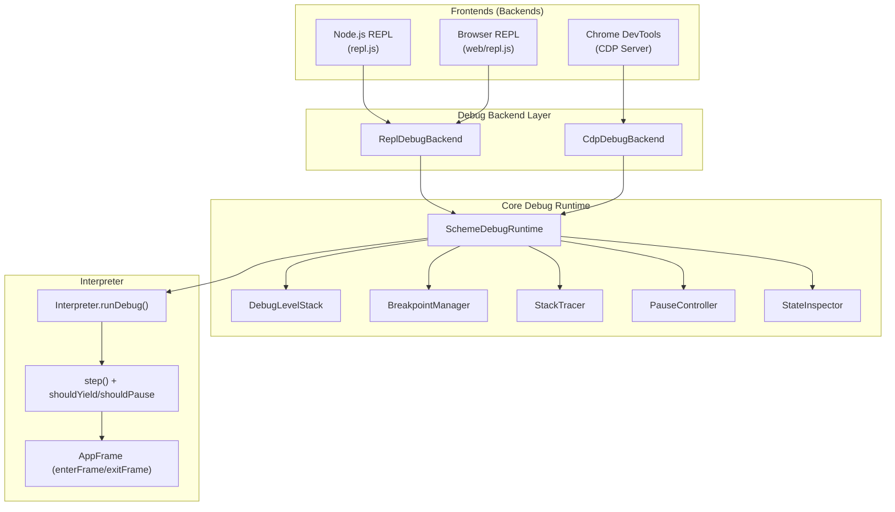

# Proper Lisp Debugger — Comprehensive Design & Implementation Plan

## Goal

Build a **proper Lisp-style debugger** for scheme-js that supports nested debug levels (like Common Lisp), cooperative pause, high-performance execution, and three backends: Node.js REPL, Browser REPL, and Chrome DevTools (CDP). Replace the current `src/debug/` implementation entirely.

---

## Design Principles

1. **Recursive debugger levels** — Errors during debug eval open nested sub-debuggers, each with their own stack context
2. **Cooperative polling** — No exception-based pausing; flag-checked yields with adaptive frequency
3. **Single execution path** — Always use `runDebug()` when debugging is enabled (no sync/async split)
4. **Minimal interpreter intrusion** — Three hooks: `shouldYield()`, `shouldPause()`, stack tracking
5. **Original variable names** — Always show user-facing names via `env.nameMap`
6. **Test-first** — Write tests before implementation per project rules
7. **Clear UX** — Prompts show both debug level and stack depth indicators

---

## Architecture



---

## Component Design

### 1. DebugLevel — Nested Debugger Context

Each debug level represents a paused execution context:

```javascript
class DebugLevel {
  constructor(level, reason, source, stack, env, parentLevel) {
    this.level = level;          // 0-based nesting depth
    this.reason = reason;        // 'breakpoint', 'step', 'exception', 'manual'
    this.source = source;        // Source location where paused
    this.stack = stack;          // Stack snapshot at pause point
    this.env = env;              // Environment at pause point
    this.parentLevel = parentLevel; // null for top-level debugger
    this.selectedFrameIndex = 0; // For :up/:down navigation
  }
}
```

### 2. DebugLevelStack — Manages Nested Levels

```javascript
class DebugLevelStack {
  constructor() {
    this.levels = [];    // Stack of DebugLevel instances
  }

  push(level) { ... }
  pop() { ... }           // :abort pops one level
  popAll() { ... }        // :toplevel pops all levels
  current() { ... }       // Returns topmost DebugLevel
  depth() { ... }         // Current nesting depth (0 = not debugging)
}
```

**Error during eval creates a nested level:**
```
scheme> (foo 5)       ;; hits breakpoint
;; Paused: breakpoint at foo.scm:3
;; #0  foo — foo.scm:3 ←
1 debug> (bar)        ;; bar is undefined → error
;; Error: Unbound variable: bar
2 debug> :bt          ;; shows stack for THIS error
  #0  <eval> — <repl>:1 ←
2 debug> :abort       ;; pops back to level 1
1 debug> :continue
```

### 3. SchemeDebugRuntime — Central Coordinator

Key changes from current implementation:
- **No `PauseException`** — uses flag-based cooperative polling instead
- **Manages `DebugLevelStack`** — each pause creates a new level
- **Adaptive yielding** — configurable yield intervals that accelerate on pause request

```javascript
class SchemeDebugRuntime {
  constructor() {
    this.enabled = false;
    this.levelStack = new DebugLevelStack();
    this.breakpointManager = new BreakpointManager();
    this.stackTracer = new StackTracer();
    this.pauseController = new PauseController();
    this.stateInspector = new StateInspector();
    this.backend = null;

    // Performance: fast-path flags
    this.hasActiveBreakpoints = false;
    this.isStepping = false;
  }
}
```

### 4. PauseController — Cooperative Polling

Replaces exception-based pausing with a flag-and-yield model:

```javascript
class PauseController {
  constructor() {
    this.pauseRequested = false;  // Set by UI "Pause" button
    this.paused = false;          // Currently paused
    this.aborted = false;         // Abort current eval
    this.abortAll = false;        // Abort to top level
    this._resumeResolver = null;  // Promise resolver

    // Adaptive yielding
    this.opCount = 0;
    this.baseYieldInterval = 10000;
    this.emergencyYieldInterval = 100;
    this.currentYieldInterval = this.baseYieldInterval;
  }

  shouldYield() {
    return ++this.opCount >= this.currentYieldInterval;
  }

  onYield() {
    this.opCount = 0;
  }

  requestPause() {
    this.pauseRequested = true;
    this.currentYieldInterval = this.emergencyYieldInterval;
  }

  async waitForResume() {
    this.paused = true;
    return new Promise(resolve => { this._resumeResolver = resolve; });
  }

  resume(action) {
    this.paused = false;
    this._resumeResolver?.({ action });
  }
}
```

### 5. StackTracer — With Original Names

```javascript
class StackTracer {
  enterFrame({ name, originalName, env, source }) {
    this.frames.push({
      name: originalName || name,  // Always prefer original name
      internalName: name,
      env,
      source
    });
  }

  replaceFrame(frameInfo) {
    // TCO: replace top frame instead of push
    this.frames[this.frames.length - 1] = { ... };
  }
}
```

### 6. BreakpointManager — Rewrite

Keep the existing O(1) design but with improvements:
- Support conditional breakpoints (expression string)
- Support hit count conditions
- `hasAny()` method for fast-path check

### 7. StateInspector — Scope Inspection

Improved to always use `env.nameMap` for displaying original variable names:

```javascript
getLocals(env) {
  const locals = {};
  for (const [internalName, value] of env.bindings) {
    const originalName = env.nameMap?.get(internalName) || internalName;
    locals[originalName] = value;
  }
  return locals;
}
```

---

## Interpreter Integration

### Single Debug Execution Path

Replace the sync/async split with a single `runDebug()` method on `Interpreter`:

#### [MODIFY] [interpreter.js](file:///Users/mark/code/scheme-js-4/src/core/interpreter/interpreter.js)

Add `runDebug()` — an async trampoline with cooperative yielding:

```javascript
async runDebug(ast, env = this.globalEnv, options = {}) {
  const registers = [null, ast, env, [], undefined];
  this.depth++;

  try {
    while (true) {
      try {
        // Cooperative yield check
        if (this.debugRuntime.pauseController.shouldYield()) {
          this.debugRuntime.pauseController.onYield();
          await new Promise(resolve => setTimeout(resolve, 0));

          // Check for pause during yield
          if (this.debugRuntime.pauseController.pauseRequested) {
            this.debugRuntime.pauseController.pauseRequested = false;
            this.debugRuntime.pauseController.currentYieldInterval =
              this.debugRuntime.pauseController.baseYieldInterval;
            // Trigger pause at current location
            await this.debugRuntime.handlePause(
              registers[CTL].source, registers[ENV], 'manual'
            );
          }
        }

        if (this.step(registers)) continue;

        // Check frame stack...
        // (same as existing run() logic)

      } catch (e) {
        // Exception handling (same as run() but with debug exception checking)
        // If debugRuntime.shouldBreakOnException(e) → handlePause
      }
    }
  } finally {
    this.depth--;
  }
}
```

Modify `step()` — replace exception-based pause with cooperative check:

```diff
 step(registers) {
   const ctl = registers[CTL];
-  if (this.debugRuntime && this.debugRuntime.enabled && ctl.source) {
-    if (this.debugRuntime.shouldPause(ctl.source, registers[ENV])) {
-      this.debugRuntime.pause(ctl.source, registers[ENV]);
-    }
-  }
+  // Debug pause check is handled in runDebug() trampoline, not here
+  // This keeps step() synchronous and fast
   return ctl.step(registers, this);
 }
```

> [!IMPORTANT]
> The key insight: `shouldPause()` returns a boolean and sets state. The actual waiting happens in `runDebug()` after it detects the pause flag, NOT inside `step()`. This keeps the synchronous `run()` path completely unaffected.

### AppFrame Integration

#### [MODIFY] [frames.js](file:///Users/mark/code/scheme-js-4/src/core/interpreter/frames.js)

`AppFrame.step()` already calls `enterFrame()`/`exitFrame()` — update to pass `originalParams`:

```diff
 if (interpreter.debugRuntime) {
   interpreter.debugRuntime.enterFrame({
     name: func.name || 'anonymous',
+    originalName: func.originalName || func.name || 'anonymous',
     env: newEnv,
     source: func.source
   });
```

---

## Debug Backend Interface

### Abstract Backend

#### [MODIFY] [debug_backend.js](file:///Users/mark/code/scheme-js-4/src/debug/debug_backend.js)

```javascript
export class DebugBackend {
  /**
   * Called when execution pauses at a new debug level.
   * Must return a Promise that resolves with the user's action.
   * @param {DebugLevel} level - The debug level that was entered
   * @returns {Promise<{action: string, ...}>}
   */
  async onEnterLevel(level) { throw new Error('abstract'); }

  /**
   * Called when a debug level is exited (via :abort or :continue).
   * @param {DebugLevel} level - The level being exited
   */
  onExitLevel(level) { }

  /** Called when debugging is enabled/disabled */
  onEnable() { }
  onDisable() { }
}
```

### ReplDebugBackend

Handles text-mode interaction. The prompt format:

```
[level] stack-depth debug> 
```

Examples:
```
[1] 3 debug> :bt        ;; Debug level 1, 3 frames deep
[2] 1 debug> :abort     ;; Nested debug level 2
[1] 3 debug> :continue  ;; Back to level 1
```

### ReplDebugCommands

Updated command set:

| Command | Aliases | Description |
|---------|---------|-------------|
| `:break <file> <line>` | `:b` | Set breakpoint |
| `:unbreak <id>` | `:ub` | Remove breakpoint |
| `:breakpoints` | `:bps` | List breakpoints |
| `:continue` | `:c` | Resume execution |
| `:step` | `:s` | Step into |
| `:next` | `:n` | Step over |
| `:finish` | `:fin` | Step out |
| `:bt` | `:backtrace` | Show stack trace (selected frame marked with `←`) |
| `:locals` | `:l` | Show local variables (original names) |
| `:up` / `:down` | | Navigate stack frames |
| `:abort` | `:a` | Pop one debug level |
| `:toplevel` | `:top` | Pop all debug levels, return to REPL |
| `:debug [on\|off]` | | Toggle debugging |
| `:break-on-exception [caught\|uncaught\|all\|none]` | `:boe` | Configure exception breaking |
| `:help` | `:h`, `:?` | Show commands |

**Bare expressions while paused** are evaluated in the selected frame's scope. If an eval throws, a **new debug level is created** with the error's stack trace.

---

## REPL UX Design

### Prompt Format

Following SBCL and Guile conventions, the debug prompt shows only the nesting level:

```
N debug>     ;; where N is the debug nesting depth (1, 2, 3...)
```

The selected stack frame is shown via `:bt` with a `←` marker — not in the prompt.

### Node.js REPL

#### [MODIFY] [repl.js](file:///Users/mark/code/scheme-js-4/repl.js)

```
scheme> (define (fact n) (if (= n 0) 1 (* n (fact (- n 1)))))
scheme> :break <unknown> 1
;; Breakpoint bp-1 set at <unknown>:1
scheme> :debug on
;; Debugging enabled
scheme> (fact 5)
;; Paused: breakpoint at <unknown>:1
;; #0  fact — <unknown>:1 ←
1 debug> :bt
  #0  fact — <unknown>:1 ←
  #1  <toplevel> — <repl>:1
1 debug> :step
;; Paused: step at <unknown>:1
;; → (if (= n 0) 1 (* n (fact (- n 1))))
1 debug> n
;; => 5
1 debug> (/ 1 0)
;; Error: Division by zero
;; Entering sub-debugger...
2 debug> :bt
  #0  <eval> — <repl>:1 ←
2 debug> :abort
;; Returning to debug level 1
1 debug> :continue
;; => 120
scheme>
```

### Browser REPL

#### [MODIFY] [repl.js](file:///Users/mark/code/scheme-js-4/web/repl.js)

Visual changes:
- **Status bar** below shell header: "RUNNING" (green), "PAUSED (level N)" (amber/red)
- **Prompt**: Changes to `N debug>` when paused (e.g. `1 debug>`, `2 debug>`)
- **Input area**: Disabled during execution (greyed out), enabled during pause
- **PAUSE button**: Visible during async execution, calls `pauseController.requestPause()`
- **On pause**: Auto-display the current frame with `←` marker

---

## Chrome DevTools (CDP) Integration

### Phase 5 — Future work (after REPL debugger is solid)

#### [NEW] [cdp_debug_backend.js](file:///Users/mark/code/scheme-js-4/src/debug/cdp_debug_backend.js)

Custom CDP server that bridges Chrome DevTools to `SchemeDebugRuntime`:
- Uses the **Custom CDP Server** approach from [node_devtools_integration.md](file:///Users/mark/code/scheme-js-4/docs/node_devtools_integration.md)
- Maps CDP domains (`Debugger.*`, `Runtime.*`) to `SchemeDebugRuntime` methods
- Generates source maps from Scheme source locations to enable DevTools source display
- `Debugger.paused` events mapped from `SchemeDebugRuntime.onPause`
- `Runtime.evaluate` mapped to scoped eval within the current debug level

---

## File Changes Summary

### Delete (old implementation)
- All files in `src/debug/` will be rewritten from scratch

### New/Rewritten Files

| File | Status | Description |
|------|--------|-------------|
| [debug_level.js](file:///Users/mark/code/scheme-js-4/src/debug/debug_level.js) | NEW | `DebugLevel` and `DebugLevelStack` classes |
| [scheme_debug_runtime.js](file:///Users/mark/code/scheme-js-4/src/debug/scheme_debug_runtime.js) | REWRITE | Central coordinator with nesting support |
| [breakpoint_manager.js](file:///Users/mark/code/scheme-js-4/src/debug/breakpoint_manager.js) | REWRITE | Fast O(1) lookup, conditional breakpoints |
| [stack_tracer.js](file:///Users/mark/code/scheme-js-4/src/debug/stack_tracer.js) | REWRITE | TCO support, original names |
| [pause_controller.js](file:///Users/mark/code/scheme-js-4/src/debug/pause_controller.js) | REWRITE | Flag-based cooperative polling |
| [state_inspector.js](file:///Users/mark/code/scheme-js-4/src/debug/state_inspector.js) | REWRITE | Original name display, CDP formatting |
| [debug_backend.js](file:///Users/mark/code/scheme-js-4/src/debug/debug_backend.js) | REWRITE | Abstract interface with nesting support |
| [repl_debug_backend.js](file:///Users/mark/code/scheme-js-4/src/debug/repl_debug_backend.js) | REWRITE | Text-mode backend with level/stack prompt |
| [repl_debug_commands.js](file:///Users/mark/code/scheme-js-4/src/debug/repl_debug_commands.js) | REWRITE | Full command set with nesting |
| [index.js](file:///Users/mark/code/scheme-js-4/src/debug/index.js) | REWRITE | Barrel exports |
| [cdp_debug_backend.js](file:///Users/mark/code/scheme-js-4/src/debug/cdp_debug_backend.js) | NEW (Phase 5) | Chrome DevTools Protocol server |

### Modified Files

| File | Changes |
|------|---------|
| [interpreter.js](file:///Users/mark/code/scheme-js-4/src/core/interpreter/interpreter.js) | Add `runDebug()`, modify `step()` to remove exception-based pause |
| [frames.js](file:///Users/mark/code/scheme-js-4/src/core/interpreter/frames.js) | Pass `originalName` in `enterFrame()` |
| [repl.js](file:///Users/mark/code/scheme-js-4/repl.js) | Nested debug readline loop, level+stack prompt |
| [web/repl.js](file:///Users/mark/code/scheme-js-4/web/repl.js) | Status bar, debug prompt, input disable during eval |
| [scheme_entry.js](file:///Users/mark/code/scheme-js-4/src/packaging/scheme_entry.js) | Export new debug classes |
| [architecture.md](file:///Users/mark/code/scheme-js-4/docs/architecture.md) | Document new debug component descriptions |

---

## Verification Plan

### Automated Tests

Tests will be written **before** implementation per project rules. All tests run via:

```bash
# turbo
node run_tests_node.js
```

#### Phase 1 Tests — Core Components

| Test File | What It Tests |
|-----------|--------------|
| `tests/unit/debug_level_tests.js` | `DebugLevel` creation, `DebugLevelStack` push/pop/popAll/current/depth |
| `tests/unit/breakpoint_manager_tests.js` | Set/remove/has/clear, conditional breakpoints, `hasAny()` |
| `tests/unit/stack_tracer_tests.js` | enterFrame/exitFrame/replaceFrame, original names, getStack, depth |
| `tests/unit/pause_controller_tests.js` | shouldYield counting, requestPause, adaptive intervals, resume/abort |
| `tests/unit/state_inspector_tests.js` | getLocals with nameMap, value serialization |

#### Phase 2 Tests — Interpreter Integration

| Test File | What It Tests |
|-----------|--------------|
| `tests/functional/debug_integration_tests.js` | Real breakpoint → pause → resume flow using `runDebug()`. Stepping (into/over/out). Manual pause via `requestPause()`. Performance: debug overhead < 20% |

#### Phase 3 Tests — Backend & Commands

| Test File | What It Tests |
|-----------|--------------|
| `tests/unit/repl_debug_commands_tests.js` | Command parsing, all commands with mocked runtime |
| `tests/unit/repl_debug_backend_tests.js` | Prompt formatting with level/stack, onEnterLevel/onExitLevel |

#### Phase 4 Tests — E2E REPL

| Test File | What It Tests |
|-----------|--------------|
| `tests/functional/repl_debug_e2e.mjs` | Spawns Node.js REPL, simulates: define function → set breakpoint → trigger → inspect locals → step → continue → verify result. Also: eval error → nested debug level → :abort → back to parent |

All test files must be registered in `tests/test_manifest.js`. Run:
```bash
# turbo
node run_tests_node.js
```

### Manual Verification

#### Browser REPL Testing

1. Start HTTP server: `python3 -m http.server 8080`
2. Open `http://localhost:8080/web/ui.html`
3. Verify:
    - Type `:debug on` → "Debugging enabled"
    - Type `:break <unknown> 1` → breakpoint set message
    - Define a function and call it → should pause
    - Prompt shows `[1] N debug>`
    - `:bt` shows stack trace
    - `:locals` shows variables with original names
    - Typing an expression with an error creates nested level `[2]`
    - `:abort` returns to `[1]`
    - `:continue` resumes and shows result
    - PAUSE button works during long computation (`(let loop () (loop))`)

#### Node.js REPL Testing

1. Run: `node repl.js`
2. Same verification steps as browser, but with text prompts

---

## Phased Implementation Order

| Phase | Focus | Depends On |
|-------|-------|-----------|
| **Phase 1** | Core debug components (fresh) | Nothing |
| **Phase 2** | Interpreter `runDebug()` + hooks | Phase 1 |
| **Phase 3** | Backend interface + REPL commands | Phase 1 |
| **Phase 4** | REPL integration (Node + Browser) | Phase 2 + 3 |
| **Phase 5** | Chrome DevTools CDP backend | Phase 1-4 |
| **Phase 6** | Documentation + benchmarks | Phase 1-5 |
